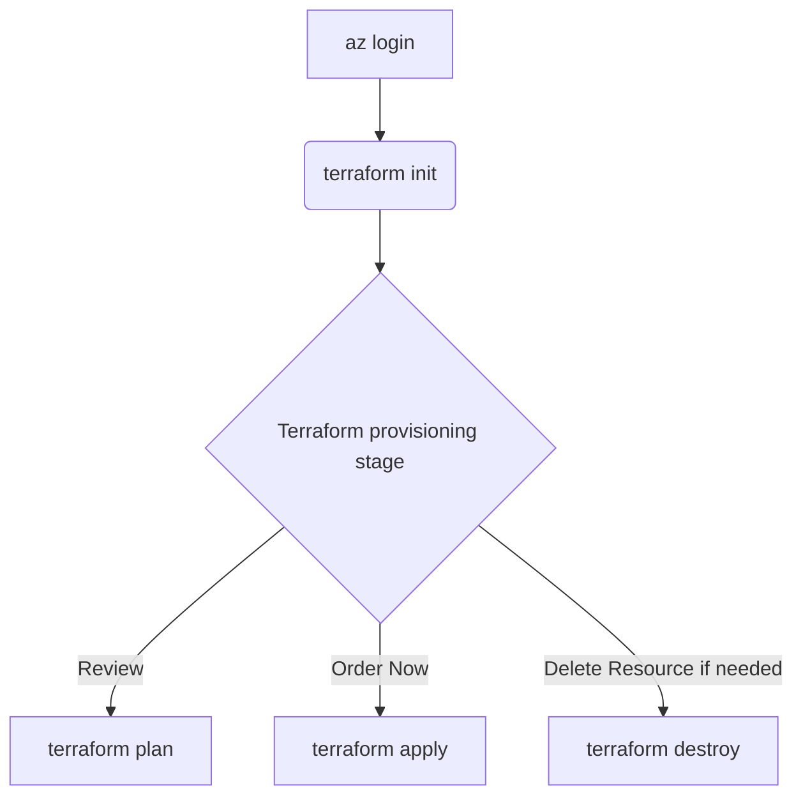

# Azure Infrastructure Terraform Templates

> This approach focuses on `setting up the required infrastructure via Terraform`. It allows for source control of not only the solution code, connections, and setups `but also the infrastructure itself`.

<div align="center">
  
</div>

<div align="center">
  
</div>

## Prerequisites

- An `Azure subscription is required`. All other resources, including instructions for creating a Resource Group, are provided in this workshop.
- `Contributor role assigned or any custom role that allows`: access to manage all resources, and the ability to deploy resources within subscription.
- Please ensure that:
  - [Terraform is installed on your local machine](https://developer.hashicorp.com/terraform/tutorials/azure-get-started/install-cli#install-terraform).
  - [Install the Azure CLI](https://learn.microsoft.com/en-us/cli/azure/install-azure-cli) to work with both Terraform and Azure commands.

## Overview 

Templates structure:

```
.
├── README.md
├────── main.tf
├────── variables.tf
├────── provider.tf
├────── terraform.tfvars
├────── outputs.tf
```

- main.tf `(Main Terraform configuration file)`: This file contains the core infrastructure code. It defines the resources you want to create, such as virtual machines, networks, and storage. It's the primary file where you describe your infrastructure in a declarative manner.
- variables.tf `(Variable definitions)`: This file is used to define variables that can be used throughout your Terraform configuration. By using variables, you can make your configuration more flexible and reusable. For example, you can define variables for resource names, sizes, and other parameters that might change between environments.
- provider.tf `(Provider configurations)`: Providers are plugins that Terraform uses to interact with cloud providers, SaaS providers, and other APIs. This file specifies which providers (e.g., AWS, Azure, Google Cloud) you are using and any necessary configuration for them, such as authentication details.
- terraform.tfvars `(Variable values)`: This file contains the actual values for the variables defined in `variables.tf`. By separating variable definitions and values, you can easily switch between different sets of values for different environments (e.g., development, staging, production) without changing the main configuration files.
- outputs.tf `(Output values)`: This file defines the output values that Terraform should return after applying the configuration. Outputs are useful for displaying information about the resources created, such as IP addresses, resource IDs, and other important details. They can also be used as inputs for other Terraform configurations or scripts.

> KeyVault:

<div align="center">
  
</div>

<div align="center">
  
</div>

> Artifact Signing Account:

<div align="center">
  
</div>
  
## How to execute it 



!!! important
  Update `terraform.tfvars` with your information before running these commands.

### 1. Sign in to Azure

Change to the Terraform directory, then authenticate with the Azure CLI.

```sh
cd terraform-infrastructure
az login
```


### 2. Initialize Terraform

Download the required provider plugins and initialize the backend.

```sh
terraform init
```


### 3. Review the plan

Inspect the planned changes before provisioning resources.

```sh
terraform plan -var-file terraform.tfvars
```


### 4. Apply the configuration

Apply the reviewed changes. Terraform will prompt for confirmation.

```sh
terraform apply -var-file terraform.tfvars
```


### 5. Remove resources when finished

Destroy the Terraform-managed resources when they are no longer required. Terraform will prompt for confirmation.

```sh
terraform destroy -var-file terraform.tfvars
```


